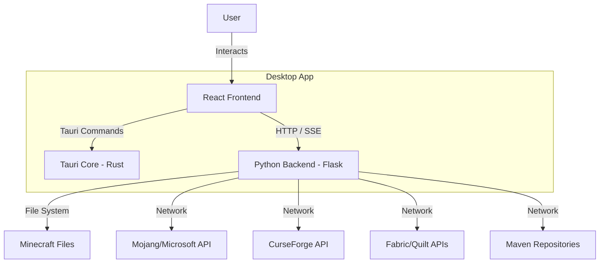
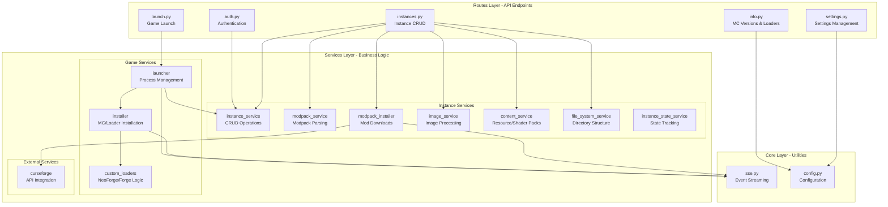
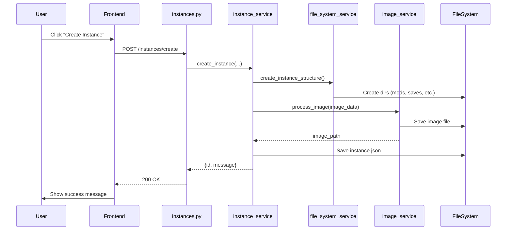
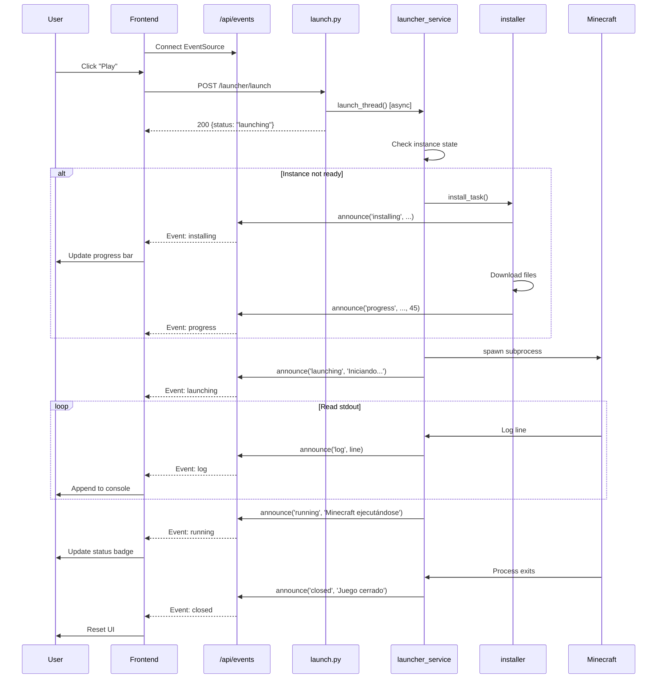
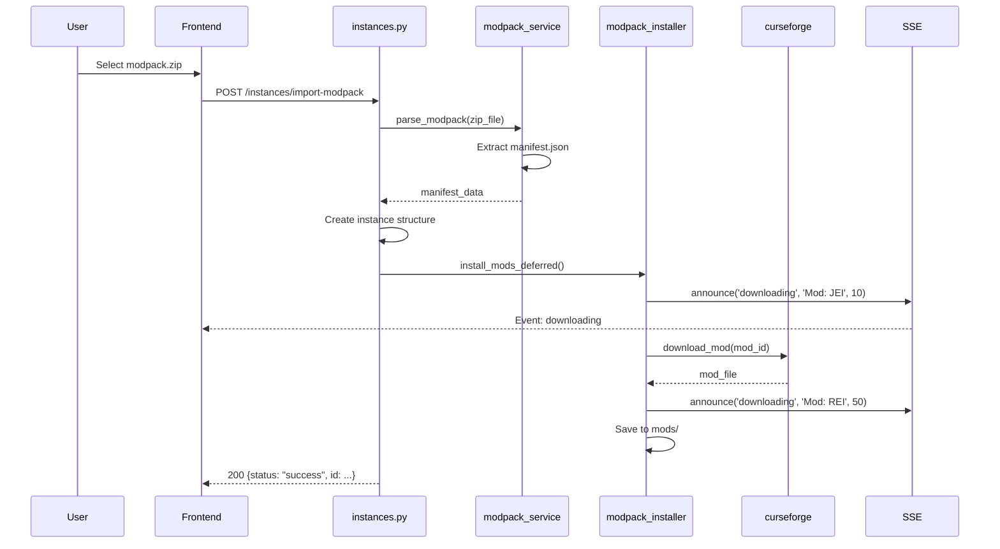

# Architecture Overview

Zenith Launcher utiliza una arquitectura híbrida que combina una shell de escritorio de alto rendimiento basada en Rust (Tauri), un frontend moderno en React (Vite + React + TypeScript), y un backend robusto en Python (Flask) para la lógica del launcher.

## High-Level Diagram



---

## Components

### 1. Frontend (`web/src`)

Construido con React, TypeScript, y Vite. Maneja todas las interacciones de usuario y renderizado de UI.

**Estructura:**
- **`core/`**: Lógica central independiente de la UI
  - `api/`: Cliente TypeScript para el backend Python
  - `state/`: Zustand store (`useLauncher`) para estado global
  
- **`modules/`**: Módulos basados en features
  - `auth/`: Lógica y UI de autenticación
  - `navigation/`: Bottombar, Sidebar, Topbar, PlayButton
  - `views/`: Vistas principales (`Home`, `Instances`, `Console`, `Settings`)
  
- **`ui/`**: Componentes de UI reutilizables (basados en Shadcn/UI)
  - Buttons, Inputs, Dialogs, Cards, etc.

---

### 2. Backend (`api/app`)

Construido con Python y Flask. Corre como un proceso sidecar administrado por Tauri.

#### Backend Architecture - Three-Tier Design



#### Directory Structure

```
api/app/
├── config.py              # Configuration & paths
├── __init__.py            # App factory
├── core/                  # Core utilities
│   ├── __init__.py
│   └── sse.py             # Server-Sent Events system
├── routes/                # API Endpoints (Blueprints)
│   ├── __init__.py
│   ├── auth.py            # /api/auth/* - Authentication
│   ├── info.py            # /api/info/* - Versions & loaders
│   ├── instances.py       # /api/instances/* - Instance CRUD
│   ├── launch.py          # /api/launcher/* - Game launch
│   └── settings.py        # /api/settings/* - Settings management
└── services/              # Business Logic
    ├── __init__.py
    ├── external/          # External API integrations
    │   ├── __init__.py
    │   └── curseforge.py  # CurseForge API client
    ├── game/              # Game execution & installation
    │   ├── __init__.py
    │   ├── installer.py   # Minecraft/Loader installer
    │   ├── launcher.py    # Game process manager
    │   └── custom_loaders.py  # Custom NeoForge/Forge logic
    └── instances/         # Instance management
        ├── __init__.py
        ├── instance_service.py        # Core CRUD
        ├── modpack_service.py         # Modpack parsing
        ├── modpack_installer.py       # Mod downloads
        ├── image_service.py           # Image processing
        ├── content_service.py         # Resource packs, etc.
        ├── file_system_service.py     # Directory creation
        └── instance_state_service.py  # State tracking
```

#### Key Backend Patterns

**Singleton Services:**
Todos los servicios se exportan como singletons para compartir estado:
```python
# En instance_service.py
instance_service = InstanceService()

# Uso en routes
from app.services.instances.instance_service import instance_service
instances = instance_service.list_instances()
```

**SSE Event System:**
Sistema centralizado de eventos para comunicación en tiempo real:
```python
from app.core.sse import announce

announce('installing', 'Descargando librerías...', progress=45)
announce('log', '[INFO] Game started')
announce('error', 'Java not found')
```

**Threading para operaciones largas:**
```python
threading.Thread(
    target=launcher_service.launch_thread,
    args=(instance_id, username),
    daemon=True
).start()
```

---

### 3. Desktop Shell (`src-tauri`)

Administra la ventana de la aplicación y spawns el proceso backend de Python como sidecar.

**Responsabilidades:**
- Window management (size, decorations, etc.)
- Python backend lifecycle (spawn, monitor, terminate)
- Native OS integrations (file dialogs, etc.)
- Production bundling (PyInstaller + Tauri)

---

## Data Flow Examples

### Example 1: Instance Creation



---

### Example 2: Game Launch with SSE



---

### Example 3: Modpack Import



---

## File System Structure

### Development Mode
```
desktop/
├── api/                   # Python backend
├── web/                   # React frontend
├── src-tauri/             # Tauri shell
└── data/                  # Runtime data
    ├── libraries/         # Minecraft assets, versions
    │   ├── assets/
    │   ├── libraries/
    │   ├── versions/
    │   ├── cache.json
    │   └── settings.json
    └── instances/         # Game instances
        └── My_Instance/
            ├── instance.json
            ├── instance_image.jpg
            ├── mods/
            ├── resourcepacks/
            ├── shaderpacks/
            ├── saves/
            └── ...
```

### Production Mode
```
ZenithLauncher/          # Installation directory
├── Zenith.exe           # Tauri app
├── data/                # Same structure as dev
│   ├── libraries/
│   └── instances/
└── ...                  # Tauri resources
```

**Path Detection:**
```python
# config.py
def get_base_path():
    if getattr(sys, 'frozen', False):
        return Path(sys.executable).parent  # Production
    else:
        return Path(__file__).resolve().parents[3]  # Development
```

---

## Technology Stack

### Frontend
- **React** - UI framework
- **TypeScript** - Type safety
- **Vite** - Build tool & dev server
- **Zustand** - State management
- **Tailwind CSS** - Styling
- **Shadcn/UI** - Component library

### Backend
- **Flask** - Web framework
- **minecraft-launcher-lib** - Minecraft API wrapper
- **requests** - HTTP client
- **threading** - Async operations

### Desktop Shell
- **Tauri 1.x** - Desktop framework (Rust)
- **PyInstaller** - Python bundler for production

---

## Development vs Production

| Aspect | Development | Production |
|--------|-------------|------------|
| Backend Start | `python api/main.py --dev` | Spawned by Tauri as sidecar |
| Frontend | Vite dev server (port 5173) | Static build served by Tauri |
| Hot Reload | ✅ Enabled (`--dev` flag) | ❌ Disabled |
| File Paths | Relative to `desktop/` | Relative to `.exe` location |
| Cache | Disabled for some APIs | Fully enabled |
| Bundling | Separate processes | Single executable |

---

## Security Considerations

- CORS enabled for `localhost` only during development
- File system operations sandboxed to `data/` directory
- Offline authentication uses UUID v3 (deterministic)
- No sensitive data persisted (tokens, passwords)
- Subprocess spawning with `CREATE_NO_WINDOW` on Windows

---

## Performance Optimizations

1. **Caching:** Version lists cached for 1 hour
2. **Threading:** Long operations (install, launch) run in background threads
3. **SSE Buffering:** Messages queued for efficient delivery
4. **Lazy Loading:** Mods downloaded on first launch (modpacks)
5. **Singleton Pattern:** Services reuse instances

---

## Error Handling

**Backend Pattern:**
```python
try:
    # Operation
    return jsonify({"status": "success", ...})
except Exception as e:
    announce('error', str(e))
    return jsonify({"status": "error", "message": str(e)}), 500
```

**Frontend Pattern:**
```typescript
try {
    const result = await api.instances.create(data);
    // Success
} catch (error) {
    showToast("Error", error.message);
}
```

**SSE Error Propagation:**
```python
# Backend sends error
announce('error', 'Java not found')

# Frontend listens
eventSource.onmessage = (event) => {
    if (data.status === 'error') {
        showErrorToast(data.message);
    }
}
```