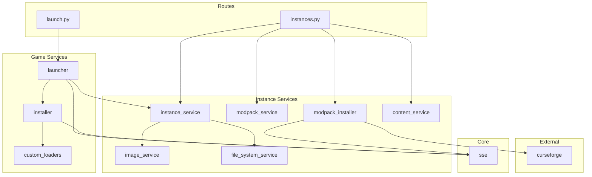

# Backend Services Documentation

Esta guía documenta en detalle todos los servicios del backend, sus responsabilidades, y cómo usarlos.

---

## Core Services (`app/core`)

### SSE - Server-Sent Events (`app/core/sse.py`)

Sistema centralizado de eventos para comunicación en tiempo real con el frontend.

#### Responsabilidades
- Cola thread-safe de mensajes
- Stream de eventos SSE
- Broadcasting de eventos a todos los clientes conectados

#### API

**`announce(status: str, message: str, progress: int = None)`**

Envía un evento al frontend.

**Parámetros:**
- `status`: Tipo de evento (`'downloading'`, `'installing'`, `'running'`, `'log'`, `'error'`, `'launching'`, `'closed'`)
- `message`: Mensaje descriptivo
- `progress`: Porcentaje de progreso (0-100), opcional

**Ejemplo:**
```python
from app.core.sse import announce

# Evento de instalación con progreso
announce('installing', 'Descargando librerías...', progress=45)

# Log del juego
announce('log', '[INFO] Game starting...')

# Error
announce('error', 'Java no encontrado en el sistema')

# Estado sin progreso
announce('running', 'Minecraft ejecutándose.')
```

**`event_stream()`**

Generador infinito que produce eventos SSE en formato `text/event-stream`.

```python
from flask import Response
from app.core.sse import event_stream

@app.route('/api/events')
def sse_endpoint():
    return Response(event_stream(), mimetype='text/event-stream')
```

#### Implementación Interna

```python
import queue
import json

msg_queue = queue.Queue()  # Thread-safe queue

def announce(status, message, progress=None):
    data = {
        "status": status,
        "message": message,
        "progress": progress
    }
    msg_queue.put(data)

def event_stream():
    while True:
        message = msg_queue.get()  # Blocks until message available
        yield f"data: {json.dumps(message)}\n\n"
```

---

## Instance Services (`app/services/instances`)

### Instance Service (`instance_service.py`)

Servicio principal para operaciones CRUD de instancias.

#### Responsabilidades
- Listar instancias
- Crear instancias
- Actualizar configuración de instancias
- Eliminar instancias
- Gestionar estados de instancias

#### API

**`list_instances() -> List[Dict]`**

Lista todas las instancias.

```python
from app.services.instances.instance_service import instance_service

instances = instance_service.list_instances()
# [
#   {
#     "id": "Mi_Instancia",
#     "name": "Mi Instancia",
#     "version": "1.20.1",
#     "modLoader": "Fabric",
#     "loaderVersion": "0.15.7",
#     "image": "http://localhost:5000/api/instances/image/...",
#     "created": 1700000000.0,
#     "state": "ready"
#   }
# ]
```

**`get_instance(instance_id: str) -> Optional[Dict]`**

Obtiene una instancia por ID.

```python
instance = instance_service.get_instance("Mi_Instancia")
if instance:
    print(f"Version: {instance['version']}")
```

**`create_instance(name, version, loader, loader_version, image_data=None) -> Dict`**

Crea una nueva instancia.

```python
result = instance_service.create_instance(
    name="Nueva Instancia",
    version="1.20.1",
    loader="Fabric",
    loader_version="0.15.7",
    image_data="data:image/png;base64,..."  # Optional
)
# {"id": "Nueva_Instancia", "message": "Instancia creada correctamente"}
```

**`update_instance(instance_id: str, data: Dict)`**

Actualiza una instancia existente.

```python
instance_service.update_instance("Mi_Instancia", {
    "name": "Nombre Nuevo",
    "version": "1.20.4",
    "image": "http://example.com/image.jpg"
})
```

**`delete_instance(instance_id: str)`**

Elimina una instancia y todos sus archivos.

```python
instance_service.delete_instance("Mi_Instancia")
```

**`update_state(instance_id: str, new_state: str)`**

Actualiza el estado de una instancia.

```python
# Estados: 'created', 'installing', 'ready', 'running', 'error'
instance_service.update_state("Mi_Instancia", "running")
```

---

### Modpack Service (`modpack_service.py`)

Parsea modpacks de CurseForge desde archivos ZIP.

#### Responsabilidades
- Extraer `manifest.json` de modpacks
- Parsear configuración del modpack
- Validar estructura del modpack
- Extraer overrides (configs, scripts, etc.)

#### API

**`parse_modpack(zip_path: Path) -> Dict`**

Parsea un archivo ZIP de modpack de CurseForge.

```python
from app.services.instances.modpack_service import modpack_service

manifest = modpack_service.parse_modpack(Path("/path/to/modpack.zip"))
# {
#   "name": "All the Mods 9",
#   "version": "0.2.45",
#   "minecraft": {
#       "version": "1.20.1",
#       "modLoaders": [{"id": "forge-47.2.0", "primary": true}]
#   },
#   "files": [
#       {"projectID": 238222, "fileID": 4826863},  # JEI
#       {"projectID": 32274, "fileID": 4831352}    # FTB Library
#   ]
# }
```

**`extract_overrides(zip_path: Path, instance_path: Path)`**

Extrae archivos override (configs, scripts) a la instancia.

```python
modpack_service.extract_overrides(
    zip_path=Path("modpack.zip"),
    instance_path=INSTANCES_DIR / "My_Modpack"
)
# Extrae: overrides/* -> instance_path/*
```

---

### Modpack Installer (`modpack_installer.py`)

Descarga e instala mods desde CurseForge.

#### Responsabilidades
- Descargar mods desde manifest
- Gestionar progreso de descargas
- Manejar reintentos y errores
- Coordinar con SSE para feedback

#### API

**`install_mods(manifest: Dict, instance_path: Path, deferred: bool = False)`**

Descarga e instala los mods del manifest.

```python
from app.services.instances.modpack_installer import modpack_installer

modpack_installer.install_mods(
    manifest=manifest_data,
    instance_path=INSTANCES_DIR / "ATM9",
    deferred=True  # No bloquea, descarga en background
)
```

**Parámetros:**
- `manifest`: Diccionario con lista de `files`
- `instance_path`: Ruta de la instancia
- `deferred`: Si es True, retorna inmediatamente y descarga en background

---

### Image Service (`image_service.py`)

Procesa y guarda imágenes de instancias.

#### Responsabilidades
- Procesar imágenes base64
- Descargar imágenes desde URLs
- Gestionar imágenes preset
- Guardar imágenes en instancias

#### API

**`process_image(image_data: str, instance_folder: Path) -> str`**

Procesa datos de imagen y retorna la ruta final.

```python
from app.services.instances.image_service import image_service

# Base64
final_path = image_service.process_image(
    "data:image/png;base64,iVBORw0KG...",
    INSTANCES_DIR / "Mi_Instancia"
)

# URL
final_path = image_service.process_image(
    "http://example.com/image.jpg",
    INSTANCES_DIR / "Mi_Instancia"
)

# Preset
final_path = image_service.process_image(
    "/minecraft-landscape-dark.jpg",
    INSTANCES_DIR / "Mi_Instancia"
)

# Retorna: ruta relativa o URL absoluta
```

**Tipos de entrada soportados:**
1. **Base64**: `data:image/png;base64,...`
2. **URL HTTP**: `http://...` o `https://...`
3. **Preset**: `/minecraft-landscape-dark.jpg`

---

### Content Service (`content_service.py`)

Gestiona contenido de instancias (resource packs, shader packs, data packs, worlds).

#### Responsabilidades
- Listar resource packs
- Listar shader packs
- Listar data packs
- Listar mundos guardados

#### API

**`get_resourcepacks(instance_id: str) -> List[Dict]`**

```python
from app.services.instances.content_service import content_service

packs = content_service.get_resourcepacks("Mi_Instancia")
# [{"name": "Faithful32.zip", "size": 5242880, "type": "file"}]
```

**`get_shaderpacks(instance_id: str) -> List[Dict]`**

```python
shaders = content_service.get_shaderpacks("Mi_Instancia")
# [{"name": "BSL_Shaders.zip", "size": 1048576, "type": "file"}]
```

**`get_datapacks(instance_id: str) -> List[Dict]`**

```python
datapacks = content_service.get_datapacks("Mi_Instancia")
# [{"name": "Terralith.zip", "size": 2097152, "type": "file"}]
```

**`get_worlds(instance_id: str) -> List[Dict]`**

```python
worlds = content_service.get_worlds("Mi_Instancia")
# [{"name": "My World", "folder": "My_World", "lastPlayed": 1700000000}]
```

---

### File System Service (`file_system_service.py`)

Crea estructura de directorios para instancias.

#### Responsabilidades
- Crear estructura estándar de directorios
- Asegurar que existan carpetas necesarias

#### API

**`create_instance_structure(instance_folder: Path)`**

```python
from app.services.instances.file_system_service import file_system_service

file_system_service.create_instance_structure(
    INSTANCES_DIR / "Nueva_Instancia"
)

# Crea:
# Nueva_Instancia/
# ├── mods/
# ├── resourcepacks/
# ├── shaderpacks/
# ├── saves/
# ├── config/
# └── screenshots/
```

---

### Instance State Service (`instance_state_service.py`)

Gestiona tracking de estados de instancias.

#### Responsabilidades
- Track estado actual de instancias
- Validar transiciones de estado
- Persistir estados

#### Estados Válidos
- `created` - Instancia creada, no instalada
- `installing` - Instalación en progreso
- `ready` - Lista para jugar
- `running` - Juego ejecutándose
- `error` - Error detectado

---

## Game Services (`app/services/game`)

### Launcher Service (`launcher.py`)

Gestiona el proceso de lanzamiento del juego.

#### Responsabilidades
- Preparar comando de lanzamiento
- Spawn del proceso de Minecraft
- Captura y stream de logs
- Detección de estado del juego
- Gestión de ciclo de vida del proceso

#### API

**`launch_thread(instance_id: str, username: str)`**

Lanza una instancia (debe ejecutarse en thread separado).

```python
from app.services.game.launcher import launcher_service
import threading

threading.Thread(
    target=launcher_service.launch_thread,
    args=("Mi_Instancia", "Player123"),
    daemon=True
).start()
```

#### Flujo de Lanzamiento

1. **Cargar configuración** de `instance.json`
2. **Verificar instalación** (instalar si es necesario)
3. **Preparar opciones de Java** (RAM, JVM args)
4. **Construir comando** con `minecraft-launcher-lib`
5. **Spawn proceso** con `subprocess.Popen`
6. **Stream logs** a través de SSE
7. **Detectar inicio del juego** (búsqueda de patterns en logs)
8. **Monitorear proceso** hasta cierre
9. **Actualizar estado** final de instancia

#### Detección de Estado

```python
# Patterns que indican que el juego está corriendo
game_visible = any(x in log_line for x in [
    "LWJGL", "OpenAL", "Sound engine", 
    "OpenGL", "Setting user:", "Backend library"
])
```

---

### Installer Service (`installer.py`)

Instala Minecraft y mod loaders usando `minecraft-launcher-lib`.

#### Responsabilidades
- Instalar versiones vanilla de Minecraft
- Instalar Fabric, Quilt
- Coordinar con `custom_loaders` para Forge/NeoForge
- Reportar progreso vía SSE
- Manejar callbacks de instalación

#### API

**`install_task(mc_version: str, loader: str, loader_version: str, instance_id: str)`**

```python
from app.services.game.installer import install_task

install_task(
    mc_version="1.20.1",
    loader="Fabric",
    loader_version="0.15.7",
    instance_id="Mi_Instancia"
)
```

#### Callbacks de Progreso

```python
def set_status(status: str):
    announce('installing', status)

def set_progress(progress: int):
    announce('installing', 'Descargando...', progress=progress)

# Usado internamente por minecraft-launcher-lib
callback = {
    "setStatus": set_status,
    "setProgress": set_progress
}
```

---

### Custom Loaders Service (`custom_loaders.py`)

Lógica personalizada para instalación de Forge y NeoForge.

#### Responsabilidades
- Instalar Forge (todas las versiones)
- Instalar NeoForge (legacy y nuevas versiones)
- Detectar instaladores correctos
- Manejar edge cases de instalación

#### API

**`install_forge(mc_version: str, forge_version: str) -> str`**

```python
from app.services.game.custom_loaders import install_forge

version_id = install_forge("1.20.1", "1.20.1-47.2.0")
# Retorna: ID de versión instalada (ej: "1.20.1-forge-47.2.0")
```

**`install_neoforge(mc_version: str, neoforge_version: str) -> str`**

```python
from app.services.game.custom_loaders import install_neoforge

version_id = install_neoforge("1.20.1", "1.20.1-47.1.106")
# Retorna: ID de versión instalada
```

#### Estrategias de Instalación

**NeoForge:**
- **Legacy (< 1.20.2)**: Repositorio `net.neoforged:forge`
- **Moderno (>= 1.20.2)**: Repositorio `net.neoforged:neoforge`

**Forge:**
- Usa `minecraft-launcher-lib.forge.install_forge_version()`
- Detecta automáticamente installer correcto

---

## External Services (`app/services/external`)

### CurseForge Service (`curseforge.py`)

Cliente para la API de CurseForge.

#### Responsabilidades
- Obtener información de mods
- Generar URLs de descarga
- Manejar API keys (si se requieren en el futuro)

#### API

**`get_mod_download_url(project_id: int, file_id: int) -> str`**

```python
from app.services.external.curseforge import get_mod_download_url

url = get_mod_download_url(
    project_id=238222,  # JEI
    file_id=4826863
)
# "https://edge.forgecdn.net/files/4826/863/jei-1.20.1-forge-15.2.0.27.jar"
```

**Construcción de URL:**
```python
# Format: https://edge.forgecdn.net/files/{XXXX}/{YYY}/{filename}
# file_id = 4826863
# XXXX = 4826 (primeros 4 dígitos)
# YYY = 863 (últimos 3 dígitos)
```

---

## Service Dependency Graph



---

## Best Practices

### Error Handling

```python
try:
    result = some_service.operation()
    return jsonify({"status": "success", "data": result})
except FileNotFoundError as e:
    return jsonify({"status": "error", "message": "Archivo no encontrado"}), 404
except Exception as e:
    announce('error', str(e))
    return jsonify({"status": "error", "message": str(e)}), 500
```

### Threading

```python
import threading

# Para operaciones largas
def long_operation():
    try:
        # ... operación
        announce('success', 'Completado')
    except Exception as e:
        announce('error', str(e))

threading.Thread(target=long_operation, daemon=True).start()
```

### SSE Updates

```python
# Inicio
announce('installing', 'Iniciando instalación...', progress=0)

# Progreso
for i in range(100):
    # ... trabajo
    announce('installing', f'Paso {i}/100', progress=i)

# Finalización
announce('ready', 'Instalación completada', progress=100)
```

### Singleton Pattern

```python
# Definición
class MyService:
    def do_something(self):
        pass

my_service = MyService()  # Singleton instance

# Uso
from app.services.my_service import my_service
my_service.do_something()
```
