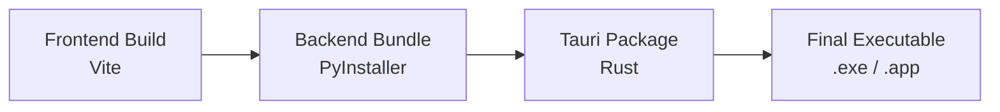

# Production Deployment Guide

Esta guía explica cómo construir y desplegar Zenith Launcher para producción.

---

## Build Process Overview

Zenith Launcher utiliza un proceso de build de varios pasos:



1. **Frontend**: React app compilado a static assets (`web/dist`)
2. **Backend**: Python empaquetado como ejecutable standalone con PyInstaller
3. **Tauri**: Bundling final con Rust, combinando frontend + backend + window manager

---

## Prerequisites

### Development Tools

- **Node.js**: v18+ (LTS recomendado)
- **Python**: v3.10+
- **Rust**: Latest stable (para Tauri)
- **C++ Build Tools**: Required para Tauri
  - **Windows**: Visual Studio Build Tools 2019+
  - **Linux**: `build-essential`
  - **macOS**: Xcode Command Line Tools

### Install Rust

```bash
# Windows/Linux/macOS
curl --proto '=https' --tlsv1.2 -sSf https://sh.rustup.rs | sh
```

### Install PyInstaller

```bash
pip install pyinstaller
```

---

## Environment Configuration

### Environment Variables

No se requieren variables de entorno específicas para el build base, pero puedes configurar:

```bash
# Opcional: Personalizar nombre de la aplicación
export TAURI_APP_NAME="ZenithLauncher"

# Opcional: Versión personalizada
export TAURI_APP_VERSION="1.0.0"
```

### Configuration Files

#### `src-tauri/tauri.conf.json`

Configuración principal de Tauri:

```json
{
  "build": {
    "beforeDevCommand": "npm run dev:frontend",
    "beforeBuildCommand": "npm run build:all",
    "devPath": "http://localhost:5173",
    "distDir": "../web/dist"
  },
  "package": {
    "productName": "Zenith Launcher",
    "version": "1.0.0"
  },
  "tauri": {
    "bundle": {
      "identifier": "com.zenith.launcher",
      "icon": [
        "icons/32x32.png",
        "icons/128x128.png",
        "icons/icon.icns",
        "icons/icon.ico"
      ],
      "externalBin": [
        "binaries/python-backend"
      ]
    }
  }
}
```

#### PyInstaller Spec

El backend debe empaquetarse con PyInstaller. Ejemplo de spec file:

**`api/backend.spec`:**
```python
# -*- mode: python ; coding: utf-8 -*-

block_cipher = None

a = Analysis(
    ['main.py'],
    pathex=['api'],
    binaries=[],
    datas=[],
    hiddenimports=[
        'flask',
        'flask_cors',
        'minecraft_launcher_lib',
        'requests'
    ],
    hookspath=[],
    hooksconfig={},
    runtime_hooks=[],
    excludes=[],
    win_no_prefer_redirects=False,
    win_private_assemblies=False,
    cipher=block_cipher,
    noarchive=False,
)
pex = PEX(a.pure, a.zipped_data, cipher=block_cipher)

exe = EXE(
    pex,
    a.scripts,
    a.binaries,
    a.zipfiles,
    a.datas,
    [],
    name='python-backend',
    debug=False,
    bootloader_ignore_signals=False,
    strip=False,
    upx=True,
    upx_exclude=[],
    runtime_tmpdir=None,
    console=False,
    disable_windowed_traceback=False,
    argv_emulation=False,
    target_arch=None,
    codesign_identity=None,
    entitlements_file=None,
)
```

---

## Build Commands

### NPM Scripts

Agrega estos scripts a `package.json` en la raíz:

**`package.json`:**
```json
{
  "scripts": {
    "dev": "concurrently \"npm run dev:backend\" \"npm run dev:frontend\" \"npm run tauri dev\"",
    "dev:frontend": "cd web && npm run dev",
    "dev:backend": "python api/main.py --dev",
    
    "build": "npm run build:all && npm run tauri build",
    "build:all": "npm run build:frontend && npm run build:backend",
    "build:frontend": "cd web && npm run build",
    "build:backend": "pyinstaller api/backend.spec --distpath src-tauri/binaries",
    
    "tauri": "tauri",
    "tauri dev": "tauri dev",
    "tauri build": "tauri build"
  }
}
```

### Step-by-Step Build

#### 1. Build Frontend

```bash
cd web
npm install
npm run build
```

**Output:** `web/dist/` - Static assets del frontend

#### 2. Build Backend

```bash
cd api
pip install -r requirements.txt
pyinstaller backend.spec --distpath ../src-tauri/binaries
```

**Output:** `src-tauri/binaries/python-backend.exe` (Windows) o `python-backend` (Linux/macOS)

#### 3. Build Tauri App

```bash
cd src-tauri
cargo build --release
```

O usa el comando npm:

```bash
npm run tauri build
```

**Output:**
- **Windows**: `src-tauri/target/release/bundle/msi/Zenith Launcher_1.0.0_x64_en-US.msi`
- **Linux**: `src-tauri/target/release/bundle/appimage/zenith-launcher_1.0.0_amd64.AppImage`
- **macOS**: `src-tauri/target/release/bundle/dmg/Zenith Launcher_1.0.0_x64.dmg`

---

## Production vs Development Differences

### File Paths

**Development:**
```python
# config.py
def get_base_path():
    return Path(__file__).resolve().parents[3]  # desktop/
```

**Production:**
```python
# config.py
def get_base_path():
    if getattr(sys, 'frozen', False):
        return Path(sys.executable).parent  # .exe location
    else:
        return Path(__file__).resolve().parents[3]
```

### Backend Detection

El backend detecta si está en modo producción:

```python
import sys

if getattr(sys, 'frozen', False):
    # Production mode
    BASE_PATH = Path(sys.executable).parent
else:
    # Development mode
    BASE_PATH = Path(__file__).resolve().parents[3]
```

### Hot Reload

**Development:** Habilitado con `--dev` flag
```python
app.run(debug=True, use_reloader=True)
```

**Production:** Deshabilitado
```python
app.run(debug=False, use_reloader=False)
```

### Data Directory

Ambos modos usan `data/` en la raíz:

```
ZenithLauncher/
├── Zenith.exe
├── data/
│   ├── libraries/      # Minecraft assets
│   │   ├── cache.json
│   │   └── settings.json
│   └── instances/      # User instances
```

---

## Platform-Specific Considerations

### Windows

**Installer Type:** MSI (Windows Installer)

**Build Requirements:**
- Visual Studio Build Tools 2019+
- Windows 10 SDK

**Subprocess Flags:**
```python
if sys.platform.startswith("win"):
    creationflags = subprocess.CREATE_NO_WINDOW
```

**Icon:** `src-tauri/icons/icon.ico`

### Linux

**Package Types:** AppImage, .deb, .rpm

**Dependencies:**
```bash
# Ubuntu/Debian
sudo apt install libwebkit2gtk-4.0-dev \
    build-essential \
    curl \
    wget \
    libssl-dev \
    libgtk-3-dev \
    libayatana-appindicator3-dev \
    librsvg2-dev
```

**Icon:** `src-tauri/icons/icon.png`

### macOS

**Package Type:** DMG

**Requirements:**
- Xcode Command Line Tools
- macOS 10.15+

**Icon:** `src-tauri/icons/icon.icns`

**Code Signing:**
```bash
# Optional: Sign the app
codesign --force --deep --sign "Developer ID Application: Your Name" "Zenith Launcher.app"
```

---

## Settings Persistence

### Settings File

**Location:** `data/libraries/settings.json`

**Default Structure:**
```json
{
  "java_path": "",
  "ram_gb": 4,
  "extra_jvm_args": ""
}
```

**Backend Loading:**
```python
from app.config import SETTINGS_FILE
import json

def load_settings():
    if SETTINGS_FILE.exists():
        with open(SETTINGS_FILE, 'r') as f:
            return json.load(f)
    return {"java_path": "", "ram_gb": 4, "extra_jvm_args": ""}
```

### Cache File

**Location:** `data/libraries/cache.json`

**Structure:**
```json
{
  "mc_releases": {
    "timestamp": 1700000000,
    "payload": ["1.21", "1.20.6", ...]
  },
  "Fabric_1.20.1": {
    "timestamp": 1700000000,
    "payload": ["0.15.7", "0.15.6", ...]
  }
}
```

**TTL:** 3600 seconds (1 hour)

---

## Troubleshooting Production Builds

### Issue: Backend no inicia

**Síntomas:** App abre pero sin conexión al backend

**Soluciones:**
1. Verificar que `python-backend.exe` esté en `binaries/`
2. Revisar `tauri.conf.json` → `tauri.bundle.externalBin`
3. Agregar hidden imports en PyInstaller spec

```python
hiddenimports=[
    'flask',
    'flask_cors',
    'minecraft_launcher_lib',
    'requests',
    # Agregar módulos que falten
]
```

### Issue: Paths incorrectos

**Síntomas:** App no encuentra `data/` o `instances/`

**Solución:** Verificar detección de `sys.frozen`:

```python
import sys
from pathlib import Path

def get_base_path():
    if getattr(sys, 'frozen', False):
        # PyInstaller bundle
        return Path(sys.executable).parent
    else:
        # Development
        return Path(__file__).resolve().parents[3]
```

### Issue: DLL missing en Windows

**Síntomas:** Error de DLL al iniciar

**Solución:** Agregar binaries a PyInstaller:

```python
a = Analysis(
    ...
    binaries=[
        ('path/to/missing.dll', '.')
    ],
    ...
)
```

### Issue: Tauri no encuentra dist

**Síntomas:** Build falla con "dist directory not found"

**Solución:**
1. Construir frontend primero: `npm run build:frontend`
2. Verificar que `web/dist` existe
3. Verificar `tauri.conf.json` → `build.distDir`

---

## Optimizations

### Frontend Optimization

**Vite Config (`web/vite.config.ts`):**
```typescript
export default defineConfig({
  build: {
    minify: 'esbuild',
    target: 'esnext',
    rollupOptions: {
      output: {
        manualChunks: {
          'vendor': ['react', 'react-dom'],
          'ui': ['@radix-ui/react-dialog', ...]
        }
      }
    }
  }
})
```

### Backend Optimization

**PyInstaller Flags:**
```bash
pyinstaller backend.spec \
  --onefile \              # Single executable
  --windowed \            # No console window
  --upx-dir=/path/to/upx  # Compress with UPX
```

### Tauri Optimization

**`Cargo.toml`:**
```toml
[profile.release]
opt-level = "z"     # Optimize for size
lto = true          # Link-time optimization
codegen-units = 1   # Better optimization
panic = "abort"     # Smaller binaries
strip = true        # Strip symbols
```

---

## Distribution

### Windows Installer

**MSI Features:**
- Instalación en `Program Files`
- Desktop shortcut
- Start menu entry
- Uninstaller
- Auto-updates (si se configura)

### Linux AppImage

**Self-contained bundle:**
```bash
chmod +x Zenith_Launcher-1.0.0.AppImage
./Zenith_Launcher-1.0.0.AppImage
```

### macOS DMG

**Drag-and-drop installer:**
1. Montar DMG
2. Arrastrar app a Applications
3. Lanzar desde Launchpad

---

## Auto-Updates (Future)

Tauri soporta auto-updates con Tauri Updater:

**`tauri.conf.json`:**
```json
{
  "updater": {
    "active": true,
    "endpoints": [
      "https://releases.zenith.launcher/{{target}}/{{current_version}}"
    ],
    "dialog": true,
    "pubkey": "YOUR_PUBLIC_KEY"
  }
}
```

**Actualizar:**
```bash
npm run tauri build
# Upload artifacts to release server
```

---

## Security Best Practices

1. **Code Signing:**
   - Windows: Certificado Authenticode
   - macOS: Developer ID Application
   - Linux: No requerido

2. **Sandboxing:**
   - Todas las operaciones file system en `data/`
   - No ejecución de código arbitrario

3. **CORS:**
   - Solo localhost en producción
   - Sin endpoints públicos expuestos

4. **Dependencies:**
   - Auditar regularmente: `npm audit`, `pip check`
   - Mantener actualizadas las dependencias

---

## Release Checklist

- [ ] Actualizar versión en `package.json`
- [ ] Actualizar versión en `src-tauri/tauri.conf.json`
- [ ] Actualizar `CHANGELOG.md`
- [ ] Correr tests (si existen)
- [ ] Build frontend: `npm run build:frontend`
- [ ] Build backend: `npm run build:backend`
- [ ] Build Tauri: `npm run tauri build`
- [ ] Probar instalador en máquina limpia
- [ ] Verificar que data/ se crea correctamente
- [ ] Verificar descarga e instalación de Minecraft
- [ ] Verificar lanzamiento de juego
- [ ] Code signing (si aplica)
- [ ] Crear release en GitHub
- [ ] Subir instaladores
- [ ] Actualizar documentación de usuario
